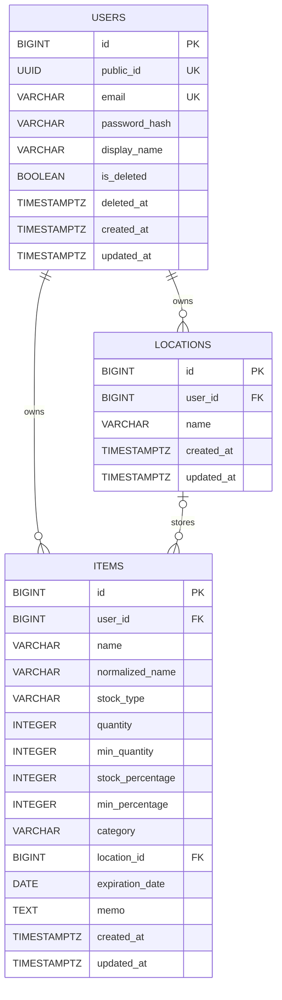

# homeStock API・データベース仕様書

## 1. 概要

homeStock は、ユーザーごとに家庭内の在庫品と保管場所を管理する REST API です。

- バックエンド: Java 21 / Spring Boot / Spring Data JPA / Spring Security
- データベース: PostgreSQL
- スキーマ管理: Flyway
- 認証: JWT を HttpOnly Cookie に保存するステートレス認証
- API ベースパス: `/api/v1`

本書は、リポジトリ内のエンティティ、Flyway マイグレーション、Controller、DTO、Service の実装を基にしています。

## 2. データベース仕様

### 2.1 ER図



### 2.2 テーブル間の関係

| 親 | 子 | 関係 | 外部キー | 削除時の挙動 |
|---|---|---|---|---|
| `users` | `locations` | 1 対 0..N | `locations.user_id → users.id` | DB上の CASCADE 指定なし |
| `users` | `items` | 1 対 0..N | `items.user_id → users.id` | DB上の CASCADE 指定なし |
| `locations` | `items` | 1 対 0..N。商品は場所未設定も可 | `items.location_id → locations.id` | 場所削除時に `items.location_id` を `NULL` にする |

APIでは、場所・商品への操作時にJWTのユーザーと各データの所有ユーザーが一致することを確認します。他ユーザーのIDを指定しても対象は取得・更新・削除できません。また、商品に場所を設定する場合も、自分が所有する場所だけを指定できます。

### 2.3 `users`

| カラム | 型 | NULL | 制約・意味 |
|---|---|---:|---|
| `id` | `BIGSERIAL` | 不可 | 主キー。内部参照用 |
| `public_id` | `UUID` | 不可 | 一意。外部向けユーザー識別子。DB既定値は `gen_random_uuid()` |
| `email` | `VARCHAR(255)` | 不可 | 一意 |
| `password_hash` | `VARCHAR(255)` | 不可 | BCryptハッシュ |
| `display_name` | `VARCHAR(100)` | 不可 | 表示名 |
| `is_deleted` | `BOOLEAN` | 不可 | 論理削除フラグ。既定値 `false` |
| `deleted_at` | `TIMESTAMPTZ` | 可 | 削除日時 |
| `created_at` | `TIMESTAMPTZ` | 不可 | 作成日時 |
| `updated_at` | `TIMESTAMPTZ` | 不可 | 更新日時 |

現状、ユーザー削除APIおよび `is_deleted` を利用した除外処理は実装されていません。

### 2.4 `locations`

| カラム | 型 | NULL | 制約・意味 |
|---|---|---:|---|
| `id` | `BIGSERIAL` | 不可 | 主キー |
| `user_id` | `BIGINT` | 不可 | 所有ユーザー。`users.id` を参照 |
| `name` | `VARCHAR(100)` | 不可 | 場所名 |
| `created_at` | `TIMESTAMPTZ` | 不可 | 作成日時 |
| `updated_at` | `TIMESTAMPTZ` | 不可 | 更新日時 |

同一ユーザー内の場所名重複はアプリケーションで拒否します。DBの一意制約ではないため、大文字・小文字なども含め、判定は文字列の完全一致です。

### 2.5 `items`

| カラム | 型 | NULL | 制約・意味 |
|---|---|---:|---|
| `id` | `BIGSERIAL` | 不可 | 主キー |
| `user_id` | `BIGINT` | 不可 | 所有ユーザー。`users.id` を参照 |
| `name` | `VARCHAR(100)` | 不可 | 商品名 |
| `normalized_name` | `VARCHAR(255)` | 可 | 商品名検索用の正規化文字列 |
| `stock_type` | `VARCHAR(20)` | 不可 | `QUANTITY` または `PERCENTAGE`。既定値 `QUANTITY` |
| `quantity` | `INTEGER` | 条件付き | 個数。0以上 |
| `min_quantity` | `INTEGER` | 可 | 最低在庫数。0以上 |
| `stock_percentage` | `INTEGER` | 条件付き | 残量割合。0〜200 |
| `min_percentage` | `INTEGER` | 可 | 最低在庫割合。0〜200 |
| `category` | `VARCHAR(20)` | 不可 | 商品カテゴリ |
| `location_id` | `BIGINT` | 可 | 保管場所。`locations.id` を参照 |
| `expiration_date` | `DATE` | 可 | 消費・賞味期限 |
| `memo` | `TEXT` | 可 | API入力では最大1000文字 |
| `created_at` | `TIMESTAMPTZ` | 不可 | 作成日時 |
| `updated_at` | `TIMESTAMPTZ` | 不可 | 更新日時 |

在庫管理方式ごとの条件は次のとおりです。

| `stock_type` | 必須 | 任意 | `NULL` 必須 |
|---|---|---|---|
| `QUANTITY` | `quantity` | `min_quantity` | `stock_percentage`, `min_percentage` |
| `PERCENTAGE` | `stock_percentage` | `min_percentage` | `quantity`, `min_quantity` |

カテゴリは以下の6種類です。

| 値 | 意味 |
|---|---|
| `FOOD` | 食品 |
| `DRINK` | 飲料 |
| `DAILY_GOODS` | 日用品 |
| `SEASONING` | 調味料 |
| `MEDICINE` | 医薬品 |
| `OTHER` | その他 |

商品名の重複は、同一ユーザー内で元の商品名が完全一致した場合に拒否します。検索時は、商品名とキーワードの両方に NFKC 正規化、小文字化、カタカナからひらがなへの変換を行い、部分一致で検索します。

## 3. 認証・共通仕様

### 3.1 認証

登録またはログイン成功時、JWTを `access_token` Cookie（設定で変更可）として返します。

- `HttpOnly`: `true`
- `Path`: `/`
- `Max-Age`: JWT有効期間と同じ。既定値24時間
- ローカル既定値: `Secure=false`, `SameSite=Strict`
- 本番既定値: `Secure=true`, `SameSite=Lax`
- JWTの `sub`: ユーザーの `public_id`

クライアントは認証が必要なAPIへCookieを送信する必要があります。未認証または無効・期限切れJWTの場合は `401 Unauthorized` となり、Spring Securityによるレスポンス本文は空です。

認証不要のAPIは以下だけです。

- `POST /api/v1/auth/register`
- `POST /api/v1/auth/login`
- `GET /api/v1/health`

### 3.2 JSON・日時

- リクエストとレスポンスは、本文がないAPIを除き `application/json`
- enum値は表に記載した大文字の文字列
- `expirationDate` は ISO-8601 の日付 `YYYY-MM-DD`
- DBの日時はタイムゾーン付きですが、現行のAPIレスポンスには含みません

### 3.3 共通エラーレスポンス

業務エラーおよび入力検証エラーは次の形式です。

```json
{
  "status": 400,
  "code": "VALIDATION_ERROR",
  "message": "name: Item名は必須です"
}
```

入力検証エラーが複数ある場合、現行実装では先頭の1件だけを返します。

| HTTP | code | 発生条件 |
|---:|---|---|
| 400 | `PASSWORD_MISMATCH` | 登録時のパスワード確認不一致 |
| 400 | `VALIDATION_ERROR` | DTOの入力制約違反 |
| 400 | `INVALID_STOCK_TYPE` | 管理方式と異なる在庫更新APIを使用 |
| 401 | `LOGIN_FAILED` | メールアドレスまたはパスワードが不正 |
| 404 | `USER_NOT_FOUND` | JWTのユーザーがDBに存在しない |
| 404 | `LOCATION_NOT_FOUND` | 場所が存在しない、または別ユーザー所有 |
| 404 | `ITEM_NOT_FOUND` | 商品が存在しない、または別ユーザー所有 |
| 409 | `EMAIL_ALREADY_EXISTS` | 登録メールアドレスが重複 |
| 409 | `LOCATION_ALREADY_EXISTS` | 同一ユーザーの場所名が重複 |
| 409 | `ITEM_ALREADY_EXISTS` | 同一ユーザーの商品名が重複 |

## 4. API一覧

| Method | Path | 認証 | 成功時 | 概要 |
|---|---|---:|---:|---|
| GET | `/api/v1/health` | 不要 | 200 | ヘルスチェック |
| POST | `/api/v1/auth/register` | 不要 | 201 | ユーザー登録・ログインCookie発行 |
| POST | `/api/v1/auth/login` | 不要 | 200 | ログインCookie発行 |
| GET | `/api/v1/auth/me` | 必要 | 200 | ログインユーザー取得 |
| POST | `/api/v1/auth/logout` | 必要 | 204 | ログインCookie削除 |
| GET | `/api/v1/locations` | 必要 | 200 | 場所一覧 |
| POST | `/api/v1/locations` | 必要 | 201 | 場所作成 |
| PUT | `/api/v1/locations/{id}` | 必要 | 200 | 場所更新 |
| DELETE | `/api/v1/locations/{id}` | 必要 | 204 | 場所削除 |
| GET | `/api/v1/items` | 必要 | 200 | 商品一覧・商品名検索 |
| GET | `/api/v1/items/{id}` | 必要 | 200 | 商品詳細 |
| POST | `/api/v1/items` | 必要 | 200 | 商品作成 |
| PUT | `/api/v1/items/{id}` | 必要 | 200 | 商品全体更新 |
| PATCH | `/api/v1/items/{id}/quantity` | 必要 | 204 | 個数のみ更新 |
| PATCH | `/api/v1/items/{id}/percentage` | 必要 | 204 | 割合のみ更新 |
| DELETE | `/api/v1/items/{id}` | 必要 | 204 | 商品削除 |
| GET | `/api/v1/items/summary` | 必要 | 200 | カテゴリ別商品数 |

## 5. 認証API

### `POST /api/v1/auth/register`

```json
{
  "email": "user@example.com",
  "password": "password123",
  "passwordConfirm": "password123",
  "displayName": "山田太郎"
}
```

| 項目 | 必須 | 制約 |
|---|---:|---|
| `email` | 必須 | メール形式、最大255文字 |
| `password` | 必須 | 8〜255文字、英字と数字を各1文字以上含む |
| `passwordConfirm` | 必須 | 8〜255文字、`password` と一致 |
| `displayName` | 必須 | 空白不可、最大100文字 |

成功時は `201 Created`、認証Cookieと次の本文を返します。

```json
{
  "publicId": "3f2d9f9d-8c1d-4d69-b2fc-87a69a0fb891",
  "displayName": "山田太郎",
  "message": "登録完了！"
}
```

### `POST /api/v1/auth/login`

```json
{
  "email": "user@example.com",
  "password": "password123"
}
```

`email` はメール形式・最大255文字、`password` は8〜255文字です。成功時は `200 OK`、認証Cookieと次の形式の本文を返します。

```json
{
  "publicId": "3f2d9f9d-8c1d-4d69-b2fc-87a69a0fb891",
  "displayName": "山田太郎",
  "message": "ログインしました！"
}
```

### `GET /api/v1/auth/me`

```json
{
  "publicId": "3f2d9f9d-8c1d-4d69-b2fc-87a69a0fb891",
  "displayName": "山田太郎"
}
```

### `POST /api/v1/auth/logout`

`Max-Age=0` の認証Cookieを設定し、`204 No Content` を返します。JWTのサーバー側失効リストはなく、クライアントCookieの削除によるログアウトです。

## 6. 場所API

場所レスポンスの共通形式は次のとおりです。

```json
{
  "id": 1,
  "name": "冷蔵庫"
}
```

### `GET /api/v1/locations`

ログインユーザーが所有する場所を配列で返します。並び順は保証されません。

```json
[
  { "id": 1, "name": "冷蔵庫" },
  { "id": 2, "name": "洗面所" }
]
```

### `POST /api/v1/locations`

```json
{ "name": "冷蔵庫" }
```

`name` は必須かつ最大100文字です。成功時は `201 Created` で作成した場所を返します。

### `PUT /api/v1/locations/{id}`

```json
{ "name": "キッチン棚" }
```

`name` は必須かつ最大100文字です。成功時は更新後の場所を返します。

### `DELETE /api/v1/locations/{id}`

成功時は `204 No Content` です。その場所を設定していた商品は削除されず、`locationId` と `locationName` が未設定になります。

## 7. 商品API

### 7.1 商品レスポンス

```json
{
  "id": 10,
  "name": "牛乳",
  "quantity": 2,
  "minQuantity": 1,
  "stockType": "QUANTITY",
  "stockPercentage": null,
  "minPercentage": null,
  "category": "DRINK",
  "locationId": 1,
  "locationName": "冷蔵庫",
  "expirationDate": "2026-08-25",
  "memo": "開封済み"
}
```

未設定または管理方式に該当しない項目は `null` になります。

### `GET /api/v1/items`

ログインユーザーの商品一覧を返します。並び順は保証されません。

任意の `keyword` クエリを指定すると、正規化した商品名による部分一致検索になります。

```text
GET /api/v1/items?keyword=ぎゅうにゅう
```

空文字または空白だけの `keyword` は、未指定と同じく全件取得になります。

### `GET /api/v1/items/{id}`

指定した自分の商品を返します。

### `POST /api/v1/items`

商品を作成します。現行実装の成功ステータスは `200 OK` です。

個数管理の例:

```json
{
  "name": "牛乳",
  "quantity": 2,
  "minQuantity": 1,
  "stockType": "QUANTITY",
  "stockPercentage": null,
  "minPercentage": null,
  "locationId": 1,
  "category": "DRINK",
  "memo": "開封済み",
  "expirationDate": "2026-08-25"
}
```

割合管理の例:

```json
{
  "name": "洗剤",
  "quantity": null,
  "minQuantity": null,
  "stockType": "PERCENTAGE",
  "stockPercentage": 70,
  "minPercentage": 20,
  "locationId": 2,
  "category": "DAILY_GOODS",
  "memo": null,
  "expirationDate": null
}
```

| 項目 | 必須 | 制約 |
|---|---:|---|
| `name` | 必須 | 空白不可、最大100文字 |
| `stockType` | 必須 | `QUANTITY` / `PERCENTAGE` |
| `quantity` | 条件付き必須 | `QUANTITY` 時に必須、0以上 |
| `minQuantity` | 任意 | `QUANTITY` 時のみ指定可、0以上 |
| `stockPercentage` | 条件付き必須 | `PERCENTAGE` 時に必須、0〜200 |
| `minPercentage` | 任意 | `PERCENTAGE` 時のみ指定可、0〜200 |
| `locationId` | 任意 | 自分が所有する既存の場所ID |
| `category` | 必須 | 定義済みカテゴリ |
| `memo` | 任意 | 最大1000文字 |
| `expirationDate` | 任意 | `YYYY-MM-DD` |

### `PUT /api/v1/items/{id}`

商品を全体更新します。リクエスト形式と制約は作成APIと同じです。省略項目だけを維持するPATCHではないため、更新後の状態を一式送信します。`locationId: null` で場所の割り当てを解除できます。成功時は更新後の商品を返します。

### `PATCH /api/v1/items/{id}/quantity`

```json
{ "quantity": 3 }
```

`QUANTITY` 管理の商品だけに使用できます。値は必須かつ0以上です。成功時は `204 No Content` です。

### `PATCH /api/v1/items/{id}/percentage`

```json
{ "stockPercentage": 40 }
```

`PERCENTAGE` 管理の商品だけに使用できます。値は必須かつ0〜200です。成功時は `204 No Content` です。

### `DELETE /api/v1/items/{id}`

指定した自分の商品を物理削除します。成功時は `204 No Content` です。

### `GET /api/v1/items/summary`

ログインユーザーの商品件数をカテゴリ別に返します。商品が0件のカテゴリはレスポンスに含まれません。

```json
{
  "FOOD": 3,
  "DRINK": 2,
  "DAILY_GOODS": 1
}
```

集計値は在庫の個数や割合の合計ではなく、該当カテゴリに属する商品レコード数です。

## 8. 実装上の注意事項

- 一覧APIにはページネーションと明示的なソートがありません。
- ユーザー、場所、商品間の分離はService/Repositoryの所有者条件で行っています。
- 商品名・場所名のユーザー単位の重複防止はDB一意制約ではなく、アプリケーション側の事前確認です。同時リクエストでは競合を完全には防げません。
- `items.normalized_name` は後から追加されたNULL許可カラムです。バックフィル処理はありますが、未処理の既存行はキーワード検索に一致しません。
- 割合在庫必須制約 `chk_percentage_stock_not_null` は `NOT VALID` で追加されています。追加前の不整合行は残り得ますが、追加後のINSERT・UPDATEには適用されます。
- DBの `memo` は `TEXT` ですが、API入力は最大1000文字に制限されています。
- CSRF保護は無効です。CORSは設定されたフロントエンドoriginのみを許可し、Cookie送信を許可します。
